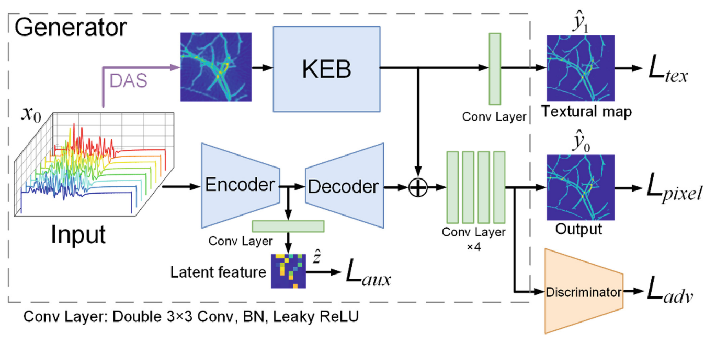

# Ki-GAN (Pytorch)
This is the implementation of the paper:

Hengrong Lan, Kang Zhou, Changchun Yang, Jun Cheng, Jiang Liu, Shenghua Gao, Fei Gao. Ki-GAN: Knowledge Infusion Generative Adversarial Network for Photoacoustic Image Reconstruction In Vivo. MICCAI 2019.

using PyTorch.

# Introduction
Photoacoustic computed tomography (PACT) breaks through the depth restriction in optical imaging, and the contrast restriction in ultrasound imaging, which is achieved by receiving thermoelastically induced ultrasound signal triggered by an ultrashort laser pulse. The photoacoustic (PA) images reconstructed from the raw PA signals usually utilize conventional reconstruc- tion algorithms, e.g. filtered back-projection. However, the performance of conventional reconstruction algorithms is usually limited by complex and uncertain physical parameters due to heterogeneous tissue structure. In recent years, deep learning has emerged to show great potential in the reconstruction problem. In this work, for the first time to our best knowledge, we propose to infuse the classical signal processing and certified knowledge into the deep learning for PA imaging reconstruction. Specifically, we make these contribu- tions to propose a novel Knowledge Infusion Generative Adversarial Network (Ki-GAN) architecture that combines conventional delay-and-sum algorithm to reconstruct PA image. We train the network on a public clinical database. Our method shows better image reconstruction performance in cases of both full- sampled data and sparse-sampled data compared with state-of-the-art methods. Lastly, our proposed approach also shows high potential for other imaging modalities beyond PACT.

 
The overall architecture of Ki-GAN.

# Sources
## slides
http://zhoukang.pro/slides/MICCAI-kigan-oral.pdf

## poster
http://zhoukang.pro/poster/MICCAI_kigan-poster.pdf

# BibTeX 

If you use this code in your project, please cite our paper:
````
@inproceedings{lan2019ki,
  title={Ki-GAN: Knowledge Infusion Generative Adversarial Network for Photoacoustic Image Reconstruction In Vivo},
  author={Lan, Hengrong and Zhou, Kang and Yang, Changchun and Cheng, Jun and Liu, Jiang and Gao, Shenghua and Gao, Fei},
  booktitle={International Conference on Medical Image Computing and Computer-Assisted Intervention},
  pages={273--281},
  year={2019},
  organization={Springer}
}
````
